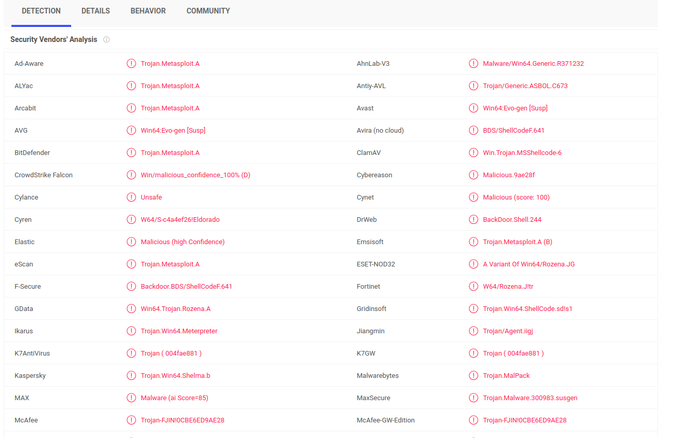

# Challenge

**Name:** Is This Sus?

**Category:** forensics

**Author:** Alex Brown (ghostccamm)

**Flag:** `metasploit` or `msfvenom`

## **Description:**

We found this very sus executable on one of our Windows servers recently. Can you check if it is malware and if it is what tool was used to create the malware?

The flag is the **name of the tool** that was used to create the malware.

## **Solution:**

Uploading the malware to [Virus Total](https://www.virustotal.com/gui/home/upload) shows that most antivirus software detect the malware being created by **Metasploit**.

