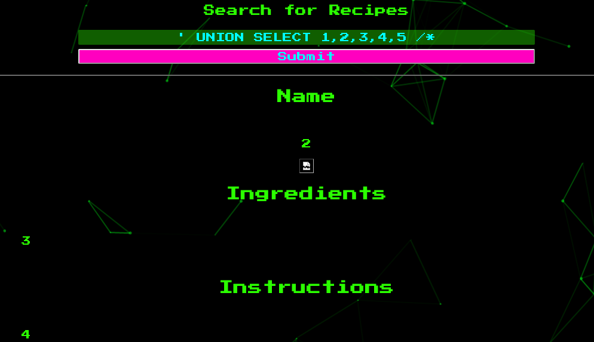
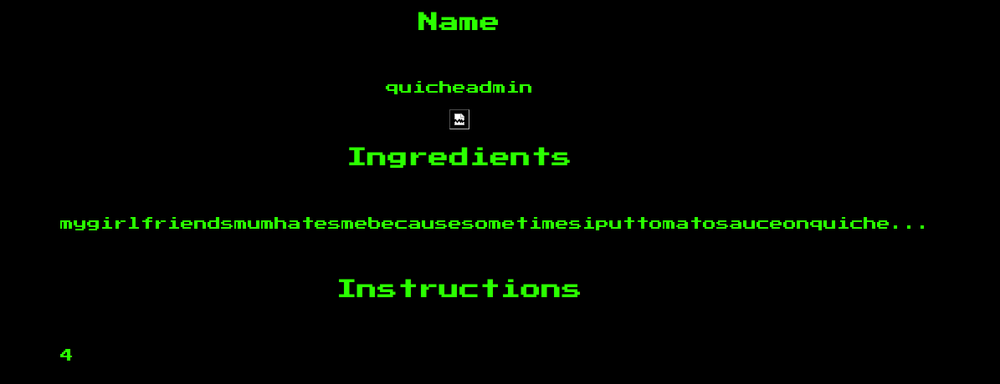
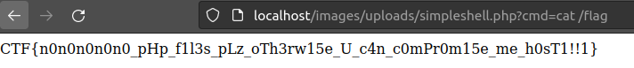

# Challenge

**Name:** Secure Quiche Lorraine

**Category:** Web

**Author:** Alex Brown (ghostccamm)

---

# Part A

**Name:** Robots Again!

**Flag:** `CTF{tH3_4tt4Ck_Ov_d3_r0b0T5_4g1n!1!11}`

## Description

So after my website got hacked several times during UWACTF, I decided to fix all of the vulnerabilities and turn it into a secure website to store my quiche lorraine recipes.

It is still under development, so I have configured it so search engines don't list the website *yet*.

## Solution

Checking `/robots.txt` we can see that `/pleasedontfindmeplz/` is listed. We can just go to this page and see a login page with the flag.

---

# Part B

**Name:** SQL Auth Bypass

**Flag:** `CTF{oH_g0d_wHi_c4n_u_U53_mY_5qL_t0_bIp455_m1_l0g1N!!}`

## Description

Oh no you found my website again! Well I have a login page now so you hackers cannot get past that!

Find a way to bypass the authentication page.

## Solution

The challenge name hints that login page is vulnerable to SQL injection and that you can bypass the authentication. I will briefly explain how bypassing authentication using SQL injection works.

Let's say that the server does the following query where the values `<username>` and `<password>` are directly replaced with the user's input.

```sql
SELECT username FROM users WHERE username = '<username>' AND password = '<password>'
```

Let's try logging in with the username `' OR '1' = '1' /*` and see how it changes the SQL query. The password could be anything (used `password123` below).

```sql
SELECT username FROM users WHERE username = '' OR '1' = '1' /*' AND password = 'password1234'
```

We can see that the end of the query has been commented out and the `WHERE` will always return true since `'1'='1'`. The website will then see that the query returned a result and will authenticate the user.

Therefore, you can login by giving the username `' OR '1' = '1' /*` to see the flag on `/pleasedontfindmeplz/recipes.php`.

---

# Part C

**Name:** UNION of SQL Recipes

**Flag:** `CTF{5qLi_4g1N_t0_l34k_mY_4Dm1n_p455w0rd!1one!}`

## Description

OH NONONONONONO! YOU AREN'T SUPPOSED TO LOOK AT MY SECURE QUICHE LORRAINE RECIPES AAAAAAAAAHHHHHHHH!

Well at least I have made the **admin page super secure**! So you won't be able to log into that or else I would be in trouble...

However, I think I forgot to make the **search functionality secure...**

Use the search functionality on the recipes page to dump the password for the admin account.

The **username** and **password** for the admin account that are in the **`admins`** table. The column names that you need to dump are **`username`** and **`password`**.

You can do this manually or use `sqlmap` to automatically exploit the vulnerability. Make sure to add the `PHPSESSID` cookie when you use `sqlmap` since you need to be authenticated to exploit the vulnerability. Also the backend database engine is **`sqlite`**.


## Solution

### Method 1: Manual Injection

The challenge hints that the search functionality is also vulnerable to SQL injection. However, this time we want to leak the values of the admin username and password.

We can do this by performing a **UNION based SQL injection**. This is when you append the results of an injected query to the end of the original SQL query.

However, first we need to know how many columns to return back otherwise the query will fail and no results will be shown. We can do this by using the `ORDER BY` keyword and incrementing the column index until a crash occurs.

We can see if we search `' ORDER BY 5 /*` the query is successful, but when we try `' ORDER BY 6 /*` the website returns only a black page. Therefore, we know that there are 5 columns that need to be returned.

We can the test to see if a UNION based SQL injection works by giving the input `' UNION SELECT 1,2,3,4,5 /*` and see that the numbers are listed.



Since the UNION based attack works, we can just show the username and password stored in the `admins` table with the input of `' UNION SELECT 1,username,password,4,5 FROM admins /*`.



We can see that the username is **quicheadmin** and the password is **mygirlfriendsmumhatesmebecausesometimesiputtomatosauceonquiche...**. Using these credentials we can log into the admin page to get the flag.

### Method 2: `sqlmap`

Since you know that the table name is `admins`, the columns you need to dump are `username` and `password` and the backend database engine is `sqlite` you can use the following `sqlmap` command to automatically dump the admin credentials.

```
python3 sqlmap.py --cookie='PHPSESSID=<your session cookie>' -u 'http://localhost/pleasedontfindmeplz/recipes.php?query=test' -p query -T admins -C username,password --dbms=sqlite --dump
```

---

# Part D

**Name:** No PHP Files

**Flag:** `CTF{n0n0n0n0n0_pHp_f1l3s_pLz_oTh3rw15e_U_c4n_c0mPr0m15e_me_h0sT1!!1}`

## Description

NONONONONONONONONONONONON GET OFF MY ADMIN PAGE!

If you refuse then please only upload image files... I haven't implemented and checks on the file uploads yet...

Can you find a way to execute commands and read the flag located at `/flag` on the target filesystem?

## Solution

As the challenge name hints, you can upload any files onto the webserver. Therefore, you can upload PHP files and execute PHP code. For an example, if you upload [`simpleshell.php`](solution/simpleshell.php) then you can execute commands by adding a `cmd` GET parameter to the url.

